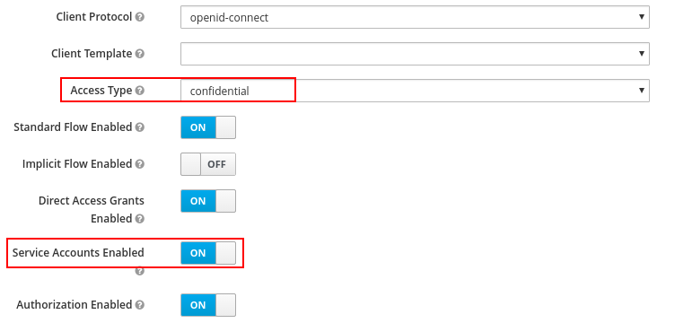
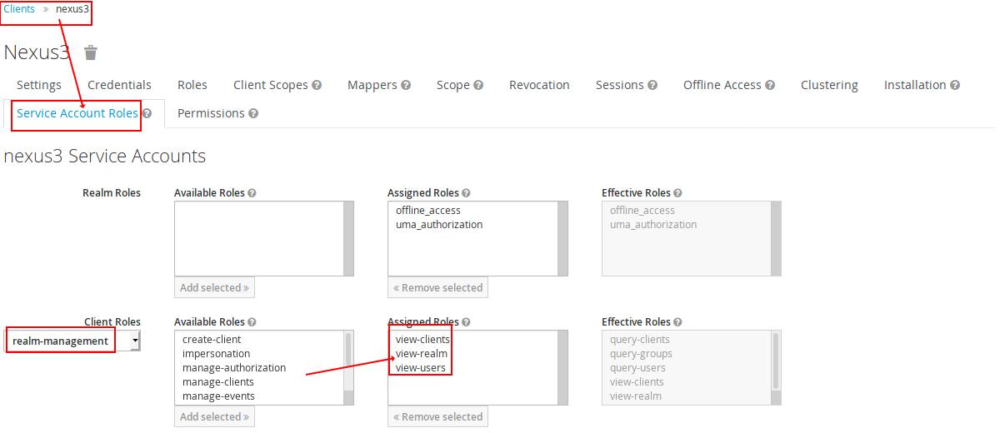
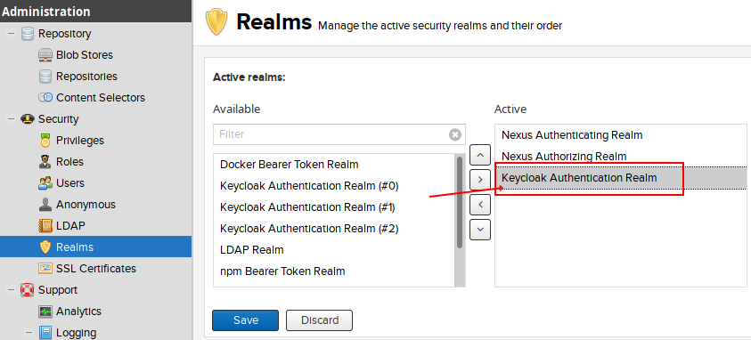
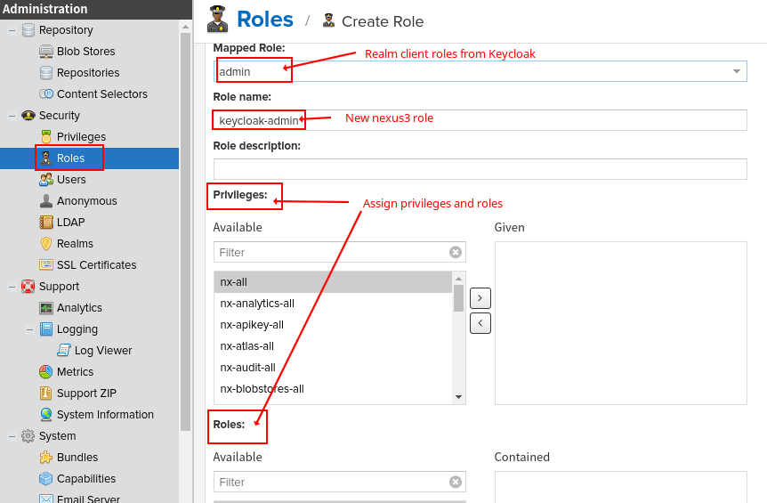

Nexus3 Keycloak Plugin
===============================
This plugin adds a Keycloak realm to Sonatype Nexus OSS and enables you to
authenticate with Keycloak Realm Users and authorize with keycloak realm client roles.

It works with Nexus 3.x and Keycloak 3.x, Keycloak 4.x.

## Warning

If you are using the version 0.2.x, and want to upgrade the plugin to 0.3.x,
you should create new roles in Nexus3 becuase the new version supports to
mapping the Realm and Client Roles of Keycloak.

But don't worry about your data or the existing role mappings, they still will work well.
The new version is compatible with the old version.

If there is something wrong after you upgrade to the new version.
**DO NOT DO ANY SAVE or UPDATE ACTIONS**, just go back to the old version and restart,
then create a issue to report your problem.

## Prerequisites
* JDK 8+ is installed
* Apache Maven is installed
* Sonatype Nexus OSS 3.x is installed

## Installation
When Nexus gets downloaded and unzipped, there are typically two directories created:
* nexus-3.3.2-02
* sonatype-work/nexus3

To avoid confusion, the conventions of the Sonatype reference will be used in the following descriptions:
* nexus-3.3.2-02 will be referred to as **$install_dir**
* sonatype-work/nexus3 will be referred to as **$data_dir**

See [https://books.sonatype.com/nexus-book/reference3/install.html#directories](https://books.sonatype.com/nexus-book/reference3/install.html#directories)
for reference.

#### 1. Build the plugin
Build and install the into your local maven repository using the following commands:
```
git clone https://github.com/flytreeleft/nexus3-keycloak-plugin.git
cd nexus3-keycloak-plugin
mvn clean install
```

Note: You can download the compiled jar from the [release page](https://github.com/flytreeleft/nexus3-keycloak-plugin/releases)
directly, just choose the latest version.

#### 2. Copy all needed jars into nexus system folder
```
PLUGIN_VERSION=0.3.0-SNAPSHOT
jars="org/github/flytreeleft/nexus3-keycloak-plugin/$PLUGIN_VERSION/nexus3-keycloak-plugin-$PLUGIN_VERSION.jar"

for jar in $(echo $jars | sed 's/ /\n/g'); do
    mkdir -p $install_dir/system/$(dirname $jar)
    cp ~/.m2/repository/$jar $install_dir/system/$jar
done
```

#### 3. Add bundle to startup properties
Append the following line to *startup.properties* file found in `$install_dir/etc/karaf`.

Please replace [PLUGIN_VERSION] by the current plugin version.
```
mvn\:org.github.flytreeleft/nexus3-keycloak-plugin/[PLUGIN_VERSION] = 200
```

Or running the following command to do that automatically:
```
echo "mvn\\:org.github.flytreeleft/nexus3-keycloak-plugin/$PLUGIN_VERSION = 200" >> $install_dir/etc/karaf/startup.properties
```

#### 4. Configure Keycloak realm client
Login to your Keycloak, and navigate to
"[Choose your realm] -> Clients -> [Choose the existing client or create a new client, e.g. 'nexus3']".

Activate the `Settings` tab, choose `confidential` for `Access Type`,
then enable `Service Accounts Enabled` and `Authorization Enabled`,
click `Save` button to make configuration effective.



Then Activate the `Service Account Roles` tab, choose `realm-management` for `Client Roles`,
then select `view-clients` and `view-users` in `Available Roles`,
click `Add selected` button to add them to `Assigned Roles`.



#### 5. Create keycloak.json
Create a *keycloak.json* file in `$install_dir/etc`.

Login to your Keycloak, and navigate to
"[Choose your realm] -> Clients -> nexus3 -> Installation -> [Choose 'Keycloak OIDC JSON' option]".

Copy the json content to `$install_dir/etc/keycloak.json`:
```
echo '{
  "realm": "default",
  "auth-server-url": "http://localhost:8080/auth",
  "ssl-required": "external",
  "resource": "nexus3",
  "credentials": {
    "secret": "a203feab-4bcf-4e73-b66e-05adc1da0da6"
  },
  "policy-enforcer": {}
}' > $install_dir/etc/keycloak.json
```

## Usage
#### 1. Activate Plugin
After installation you have to activate the plugin in the administration frontend.
You have to login with an administrative nexus account to do so. The default admin credentials are
* username: *admin*
* password: *admin123* (don't forget to change it!)

After login you can navigate to the realm administration.
Activate the `Keycloak Authentication Realm` plugin by dragging it to the right hand side.



#### 2. Map Keycloak Realm Client Roles to Nexus Roles
As a last step you have to map your Keycloak realm client roles to nexus internal roles.


A good starting point is mapping one Keycloak realm client role to *nx-admin* role,
so you can start managing Nexus with your Keycloak Login.
* Choose a Keycloak realm client role
* Think up a new unique name for the mapped role
* Add *nx-admin* to the contained roles



That's it. Now you can login your keycloak account.

## Development
#### 1. Start nexus with console
Move into your `$install_dir`. Edit the file `bin/nexus.vmoptions` to contain the following line
```
-Dkaraf.startLocalConsole=true
```

After that (re-)start nexus. It will then startup with an interactive console enabled.
(If the console doesn't show up, you may hit the Enter key after startup).
Your console should look like this afterwards:
```
karaf@root()>
```

#### 2. Install plugin bundle
Within the console just type
```
bundle:install -s file://[ABSOLUTE_PATH_TO_YOUR_JAR]
```

## Docker

You can execute command `bash docker/build.sh` to build your Nexus3 Docker image with this plugin.
The image is based on [cavemandaveman/nexus](https://github.com/cavemandaveman/nexus) which is running Nexus v3.6.0-02.
You can change the version of the base image or this plugin in `docker/Dockerfile`.

After the image is built, you should prepare your `keycloak.json` and put it to `docker/` first, then execute command `bash docker/run.sh` to start the Nexus3 container. If you want to change the default port/volume mappings, just edit `docker/run.sh`
before starting container.

## Contributing
[](https://github.com/flytreeleft/nexus3-keycloak-plugin/graphs/contributors)

Thanks to all contributors who helped to get this up and running.

## Thanks
* [nexus3-crowd-plugin](https://github.com/pingunaut/nexus3-crowd-plugin.git) by [@pingunaut](https://github.com/pingunaut)
* [keycloak-authz-client](https://github.com/keycloak/keycloak/tree/master/authz/client)
